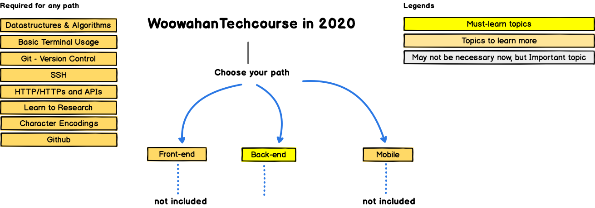

# 🔘 Roadmap

## 1. [우아한테크코스 로드맵 2020ver](https://github.com/woowacourse/back-end-roadmap "우아한테크코스 로드맵")

  
로드맵 펼치기

  
 
    <figure>
    
    
</figure>
  

## 2. [보편적인 로드맵 2020](https://github.com/devJang/developer-roadmap "로드맵")

  
로드맵 펼치기

  
 
    <figure>
    
    
    
</figure>
  

## 3. 이외에도 참고할만 로드맵

* #### [노마드 코더 : 풀스택 주니어 웹개발자가 되려면? ver2020](https://www.youtube.com/watch?v=ODa9mY2bEEc&t=294s "노마드코더")
------

  **웹 주니어 개발자가 되기 위한 Steps**

1. HTML CSS 
	- 모든 태그, 용어를 다 외우는게 절대아님 구글링이 있음 
	
	- 구조와 원리를 이해하고 어떻게 사용하는지 이해하는것에 초점을맞춤 
	
	- 어지간한 웹사이트화면을 딱 보고 클론코딩할정도 까지 공부 
	
2. 바닐라JS 
	- 프레임워크를 일찍하지말고 가장기초이자 핵심인 바닐라js를 깊이공부 
	- 깊이다져놓을수록 나중에 리엑트,뷰 등 프레임워크를 배우는것이 쉬워짐(시간을아낄수있음) 
	- "모달창 슬라이더 메뉴 드래그엔드랍" 등 웹의 인터렉티브한 부분을 바닐라js로 능숙하게 구현해낼수있을정도 까지 익혔으면, 다음 단계로 넘아가도됨(프레임웍, 백앤드 등) 
3. 백엔드 
	- NodeJS든 뭐든, 언어는 아무거나 가능  
	- 백엔드에서 CRUD를 구현해 내기        
	- '생성 읽기 수정 삭제' 가 되는 시스템을 만들어낸다는 것은, 결국 HTML,CSS,JS, DB, 등등 을 다 할줄안다는 것 
	- 결국 '게시판'하나를 온전히 만들어 낼수있다는 것 => 이정도까지 왔으면 사실상 취업가능, 이때부턴 일하면서 돈도벌고 실무를 배우며 성장하는게 좋음 
4. 이후의 단게 
	- 각자의 길을 밟아가기 

- #### 인프런 사이트 이용하기

------
​	👉 [자바 개발자 로드맵](https://www.inflearn.com/roadmaps/12 "자바 개발자")

​	👉 [스프링 완전정복](https://www.inflearn.com/roadmaps/8 "자바 개발자")

- #### [드림코딩-풀스택](https://academy.dream-coding.com/pages/912e50 "드림코딩")

------

​	Javascript,html,css 기초를 다져 포트폴리오를 만들 예정
